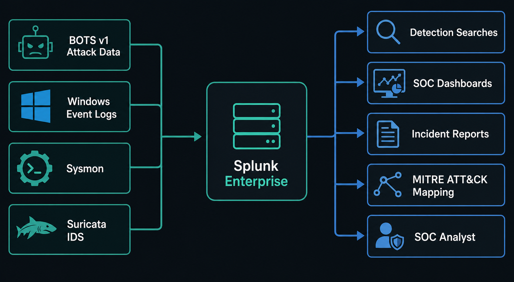
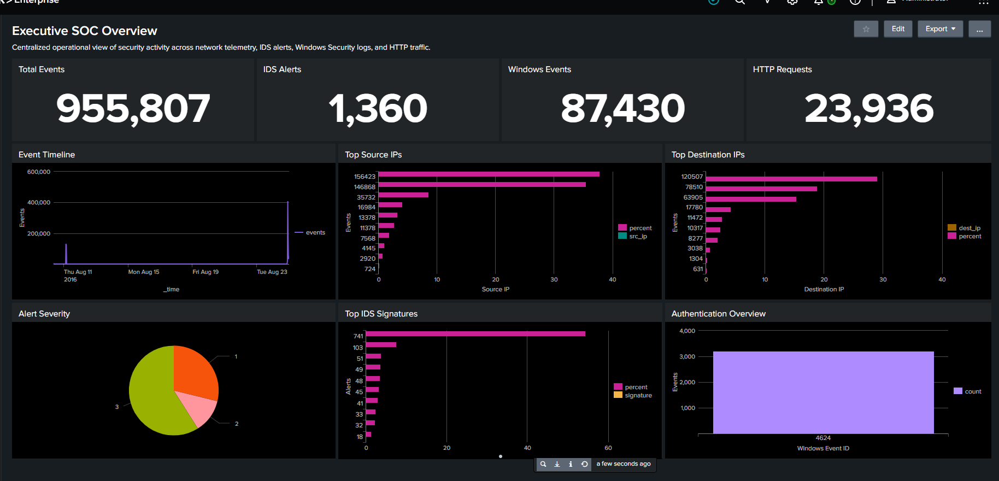
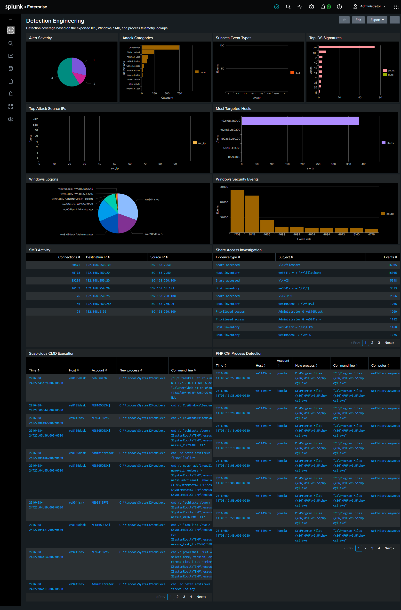
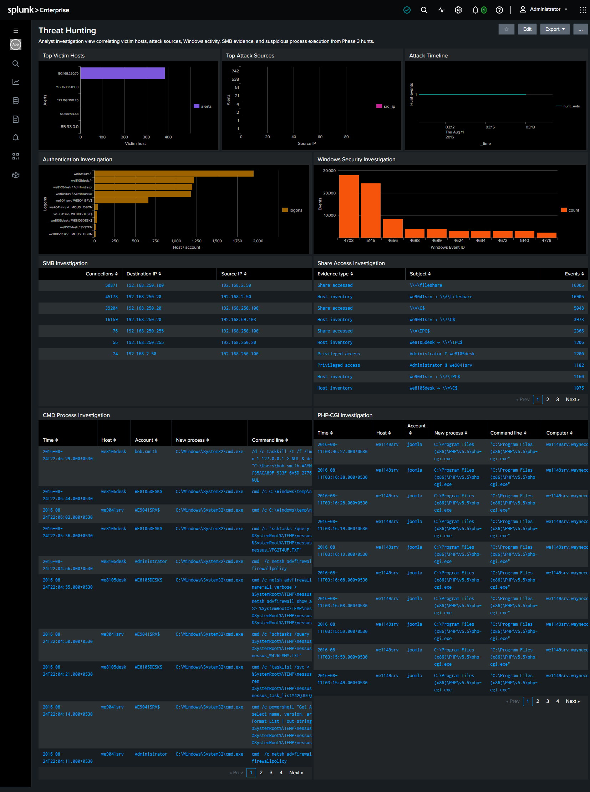

<p align="center">
  
</p>

<h1 align="center">🛡️ Splunk SOC Detection Lab</h1>

<p align="center">
  A hands-on Security Operations Center (SOC) project built with Splunk Enterprise and the BOTS v1 dataset.
</p>

<p align="center">
  <a href="#project-overview">Overview</a> •
  <a href="#dashboards">Dashboards</a> •
  <a href="#mitre-attck-coverage">MITRE ATT&amp;CK</a> •
  <a href="#screenshots">Screenshots</a> •
  <a href="#author">Author</a>
</p>

<p align="center">
  
  
  
  
  
</p>

---

## Project Overview

Splunk SOC Detection Lab is an end-to-end security operations project that demonstrates how raw telemetry can be turned into useful SOC workflows. The lab ingests enterprise-scale attack data, develops detections, maps coverage to MITRE ATT&CK, investigates suspicious activity, and presents findings through three purpose-built dashboards.

The project uses realistic data from the Splunk Boss of the SOC (BOTS) v1 Attack Only dataset. It brings together Windows Security events, Sysmon telemetry, Suricata IDS alerts, SMB activity, HTTP/IIS logs, DNS, TCP streams, vulnerability-scanner activity, and firewall records.

Rather than treating a dashboard as the final deliverable, the lab follows a practical analyst sequence:

1. Establish the data baseline and validate ingestion.
2. Create and document detection logic.
3. Investigate activity by correlating network, endpoint, authentication, and file-share evidence.
4. Turn the resulting context into executive, detection-engineering, and threat-hunting dashboards.

> **Portfolio focus:** This repository is designed to show the reasoning and artefacts behind SOC work—not only screenshots of charts.

---

## Project Highlights

| Capability | What it demonstrates |
| --- | --- |
| 🖥️ Splunk Enterprise | Practical SIEM deployment, ingestion validation, searches, lookups, and dashboard development. |
| 📦 BOTS v1 Attack Only | Analysis of a realistic, multi-source enterprise attack dataset. |
| 🔎 Detection Engineering | Documented failed-login, PowerShell, and port-scan detections. |
| 🧭 Threat Hunting | Investigation views that correlate attacker sources, victims, SMB evidence, and process execution. |
| 🗺️ MITRE ATT&CK | Detection coverage mapped to tactics and techniques. |
| 📊 Three SOC Dashboards | Separate executive, detection-engineering, and analyst-hunting use cases. |
| 🪟 Windows Telemetry | Security-event and Event ID 4688 process-creation analysis. |
| 🦈 Suricata IDS | Severity, signature, attack-category, and source-IP analysis. |
| 📁 SMB Investigation | Share access, host inventory, and privileged-account correlation. |
| 📝 Investigation Notes | Reproducible lab notes and source-controlled dashboard content. |

---

## Features

- Baseline validation for a Splunk SIEM environment and the `botsv1` index.
- Search-driven detections for brute-force behavior, PowerShell activity, and network service discovery.
- Windows Event ID 4688 process investigations for `cmd.exe` and `php-cgi.exe` execution.
- IDS reporting for alert severity, categories, event types, and high-volume signatures.
- Network investigation views for high-volume sources, victim hosts, and SMB traffic.
- A share-access investigation table that combines share, host, and privileged-account evidence.
- Three dashboard XML definitions backed by versioned CSV lookup data.
- A concise MITRE ATT&CK coverage map that connects detections to analyst objectives.

---

## Architecture

The lab centralizes telemetry in Splunk Enterprise, then uses searches, lookups, dashboard panels, and analyst investigations to move from raw events to actionable context.

<p align="center">
  
</p>

### Telemetry flow

| Data source | Examples of analyst value |
| --- | --- |
| BOTS v1 Attack Only | Attack activity and multi-source enterprise telemetry. |
| Windows Security Logs | Authentication, file/share access, and Event ID 4688 process creation. |
| Sysmon | Endpoint and process context for investigations. |
| Suricata IDS | Alert severity, categories, signatures, and network indicators. |
| SMB Streams | Lateral movement and shared-resource investigation evidence. |
| IIS / HTTP Logs | Web-request context, Joomla activity, and administrative-page investigation. |
| DNS / TCP / Firewall Logs | Network enrichment and traffic correlation. |

---

## Dataset

| Attribute | Details |
| --- | --- |
| Platform | Splunk Enterprise 10.4.2 |
| Operating System | Windows 11 |
| Dataset | BOTS v1 Attack Only |
| Primary index | `botsv1` |
| Indexed events | 955,807 |
| IDS alerts | 1,360 |
| Windows events | 87,430 |
| HTTP requests | 23,936 |

### Data validation

The environment was validated by confirming ingestion and exploring sourcetypes:

```spl
| eventcount summarize=false index=*
```

```spl
index=botsv1
| stats count by sourcetype
| sort - count
```

The result confirmed a functioning `botsv1` index with enough telemetry to perform detection engineering and threat-hunting exercises. See [labnotes.md](labnotes/) for the baseline notes.

---

## Repository Structure

```text
Splunk-SOC-Detection-Lab/
│
├── architecture/
│   ├── lab_architecture.png
│   └── soc-banner.png
│
├── dashboards/
│   ├── executive_soc_overview_dashboard.xml
│   ├── detection_engineering_dashboard.xml
│   ├── threat_hunting_dashboard.xml
│   ├── Dashboard-01-Executive-SOC-Overview.md
│   ├── Dashboard-03-Threat-Hunting.md
│   ├── README.md
│   └── lookups/
│
├── detections/
│   ├── failed_logins.md
│   ├── powershell.md
│   └── port_scan.md
│
├── incident_reports/
├── screenshots/
│   ├── dashboard-01-executive-soc-overview.png
│   ├── dashboard-02-detection-engineering.png
│   └── dashboard-03-threat-hunting.png
│

```

---

## Phase 1 — Environment Baseline

Phase 1 established the detection lab and verified that the core data sources were searchable in Splunk.

### Completed work

- Installed and configured Splunk Enterprise.
- Imported the BOTS v1 Attack Only dataset.
- Confirmed successful data ingestion into the `botsv1` index.
- Established baseline event volume and source coverage.
- Identified Windows, Suricata, SMB, HTTP, DNS, TCP, IIS, Nessus, and FortiGate telemetry.

### Outcome

The lab provides a working SIEM environment with enterprise-scale event volume and diverse security telemetry. That baseline supports the detection and investigation phases that follow.

---

## Phase 2 — Detection Engineering

Phase 2 focuses on detection content that a SOC analyst can review, tune, and map to ATT&CK techniques.

| Detection | Detection objective | Key telemetry | ATT&CK reference |
| --- | --- | --- | --- |
| [Failed Logins](detections/failed_logins.md) | Identify repeated authentication failures that may indicate password spraying or brute force. | Windows failures / EventCode 4625 | T1110 — Brute Force |
| [PowerShell Activity](detections/powershell.md) | Review PowerShell execution, including script-block and command-line context. | PowerShell Operational / EventCode 4104 | T1059.001 — PowerShell |
| [Port Scan](detections/port_scan.md) | Detect a source probing many destination ports in a short time window. | Suricata network telemetry | T1046 — Network Service Discovery |

### Representative SPL

```spl
index=botsv1 (EventCode=4625 OR action=failure)
| stats count by user, src, host
| where count >= 5
| sort - count
```

```spl
index=botsv1 sourcetype=suricata
| bin _time span=5m
| stats dc(dest_port) as unique_ports values(dest_port) as ports by _time, src_ip, dest_ip
| where unique_ports >= 20
| sort - unique_ports
```

---

## Phase 3 — Threat Hunting

Phase 3 applies the available telemetry to investigation workflows. The objective is to move between network detections, Windows activity, SMB access, and process execution instead of assessing each signal in isolation.

### Investigation workflow

| Hunt focus | Analyst question | Evidence used |
| --- | --- | --- |
| Web activity | Is suspicious web activity present around Joomla resources? | HTTP/IIS context and PHP-CGI execution. |
| Authentication | Which accounts and hosts require correlation? | Windows logons and Security Event IDs. |
| SMB access | Which systems accessed shared or administrative resources? | SMB activity, share records, host inventory, and privileged accounts. |
| Command execution | Which `cmd.exe` executions need analyst review? | Event ID 4688 process-creation events and command lines. |
| PHP-CGI execution | Is web-application process activity present? | Event ID 4688 records under the Joomla application-pool context. |

### Notable investigation evidence

- High-volume source IPs and targeted hosts prioritize network triage.
- SMB tables retain source, destination, share, host, and account context.
- Suspicious `cmd.exe` entries include command lines such as Nessus-generated batch-file execution and firewall-policy discovery.
- PHP-CGI entries show `php-cgi.exe` running under the `IIS APPPOOL\joomla` context on `we1149srv`.

---

## Dashboards

Each dashboard has a different audience and goal. They are intentionally not three copies of the same metrics.

| Dashboard | Primary audience | Purpose | Key panels |
| --- | --- | --- | --- |
| [Dashboard 01 — Executive SOC Overview](dashboards/Dashboard-01-Executive-SOC-Overview.md) | SOC lead / stakeholder | Summarize operational security posture. | Event totals, timeline, top sources and destinations, IDS severity, signatures, authentication. |
| Dashboard 02 — Detection Engineering | Detection engineer | Review active detection content and supporting evidence. | IDS categories, signatures, SMB evidence, process detections. |
| [Dashboard 03 — Threat Hunting](dashboards/Dashboard-03-Threat-Hunting.md) | SOC analyst / threat hunter | Correlate evidence from investigation workflows. | Victim hosts, attack sources, hunt timeline, SMB, CMD, PHP-CGI. |

### Dashboard source files

| Dashboard | Source definition |
| --- | --- |
| Executive SOC Overview | [executive_soc_overview_dashboard.xml](dashboards/executive_soc_overview_dashboard.xml) |
| Detection Engineering | [detection_engineering_dashboard.xml](dashboards/detection_engineering_dashboard.xml) |
| Threat Hunting | [threat_hunting_dashboard.xml](dashboards/threat_hunting_dashboard.xml) |

Dashboard definitions use Splunk Simple XML and versioned CSV lookups. Refer to [dashboards/README.md](dashboards/README.md) for the lookup-installation workflow.

---

## MITRE ATT&CK Coverage

The detection content is mapped to ATT&CK to make coverage explicit and to support clear analyst communication.

| Technique | Tactic | Detection coverage | Description |
| --- | --- | --- | --- |
| [T1110](https://attack.mitre.org/techniques/T1110/) | Credential Access | Failed Login Detection | Repeated authentication failures may indicate password spraying or brute-force attempts. |
| [T1059.001](https://attack.mitre.org/techniques/T1059/001/) | Execution | PowerShell Detection | Detects PowerShell command and script-block activity for analyst review. |
| [T1046](https://attack.mitre.org/techniques/T1046/) | Discovery | Port Scan Detection | Identifies a source touching an unusual number of destination ports. |

For the repository mapping, see [mitre_mapping.md](mitre_mapping.md).

---

## Skills Demonstrated

<table>
  <tr>
    <td><b>Detection Engineering</b></td>
    <td><b>Threat Hunting</b></td>
    <td><b>SOC Analysis</b></td>
  </tr>
  <tr>
    <td>Splunk SPL</td>
    <td>MITRE ATT&amp;CK Mapping</td>
    <td>Windows Event Analysis</td>
  </tr>
  <tr>
    <td>Suricata IDS Analysis</td>
    <td>Dashboard Development</td>
    <td>Incident Investigation</td>
  </tr>
  <tr>
    <td>Network Security Monitoring</td>
    <td>SMB Investigation</td>
    <td>Security Reporting</td>
  </tr>
</table>

---

## Technologies Used

| Technology | Use in this project |
| --- | --- |
| Splunk Enterprise | SIEM platform, SPL searches, CSV lookups, and dashboards. |
| BOTS v1 Attack Only | Core multi-source attack dataset. |
| Windows Event Logs | Authentication, file/share access, and process execution telemetry. |
| Sysmon | Endpoint-focused supporting telemetry. |
| Suricata IDS | Alert, signature, severity, and network-event analysis. |
| SMB Protocol Telemetry | Share-access and lateral-movement investigation context. |
| IIS / HTTP Logs | Web-application activity and Joomla investigation context. |
| Splunk Simple XML | Portable dashboard definitions. |
| Markdown | Detection, dashboard, MITRE, and lab documentation. |
| GitHub | Version control and portfolio publication. |

---

## Screenshots

### Executive SOC Overview

The executive view presents high-level event volume, IDS activity, Windows telemetry, HTTP volume, trends, and high-value network indicators.

<p align="center">
  
</p>

### Detection Engineering

The detection-engineering view combines IDS summaries, Windows detections, SMB evidence, and concrete Event ID 4688 process-execution results.

<p align="center">
  
</p>

### Threat Hunting

The threat-hunting view follows the analyst investigation path from victim hosts and source IPs to authentication, SMB, command execution, and PHP-CGI evidence.

<p align="center">
  
</p>

---

## Getting Started

### Prerequisites

- Splunk Enterprise
- Access to the BOTS v1 Attack Only dataset
- Permission to create an app, upload CSV lookups, and create dashboards in Splunk

### High-level setup

1. Install Splunk Enterprise and ingest the BOTS v1 Attack Only dataset.
2. Verify that the `botsv1` index is searchable.
3. Upload the CSV files under `dashboards/lookups/` as Splunk lookup files, retaining their filenames.
4. Create the dashboard XML definitions from the `dashboards/` directory.
5. Review the detection documentation and MITRE mapping before tuning searches for another environment.

> The lookup files are exported from this lab’s BOTS data. Detection thresholds and field names should be validated and tuned before use in production.

---

## Future Improvements

- Add scheduled correlation searches and risk-based alerting.
- Create a formal incident report for each high-value hunt finding.
- Add drilldowns from dashboard panels into detailed SPL investigations.
- Expand ATT&CK coverage to persistence, lateral movement, and command-and-control techniques.
- Package the project as an installable Splunk app with `app.conf`, lookup definitions, and navigation metadata.

---

## Author

**Jasti Jagadish Babu**

GitHub: [@jagadish-sec](https://github.com/jagadish-sec)

---

<p align="center">
  Built to demonstrate practical SOC analysis, detection engineering, and threat-hunting workflows with Splunk.
</p>
